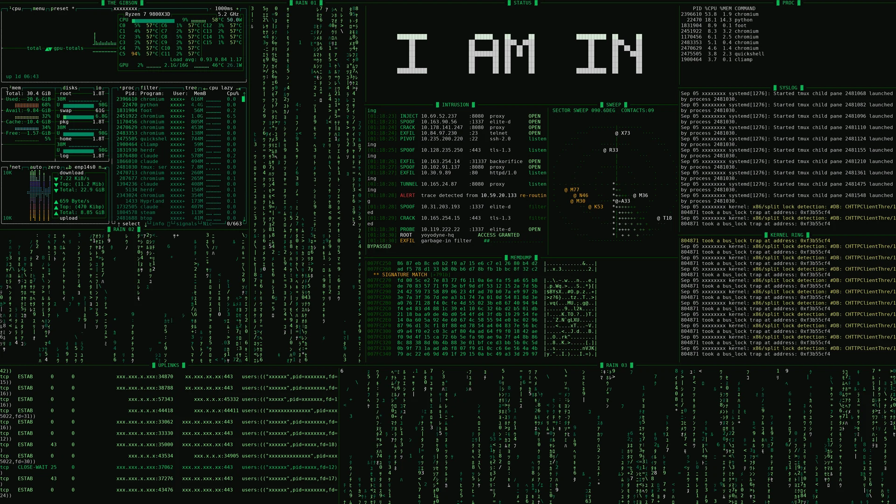
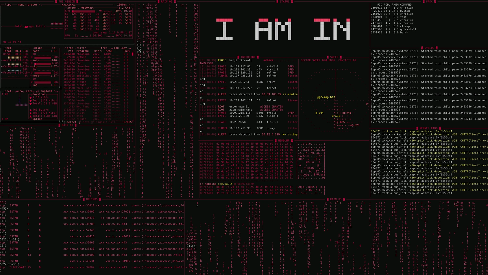
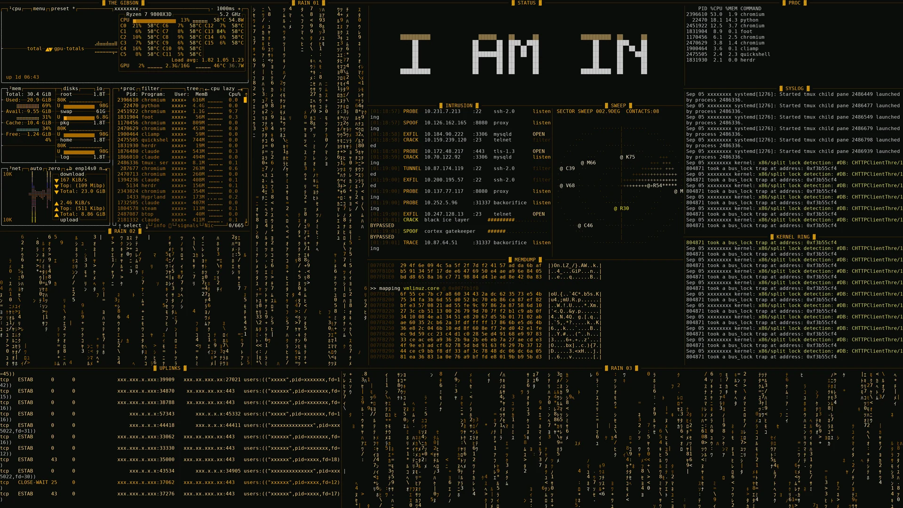
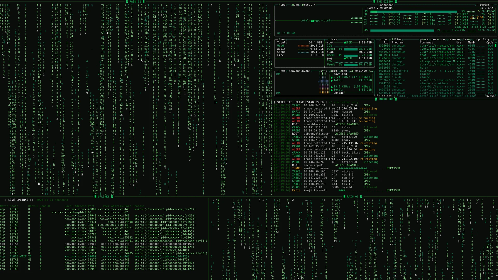
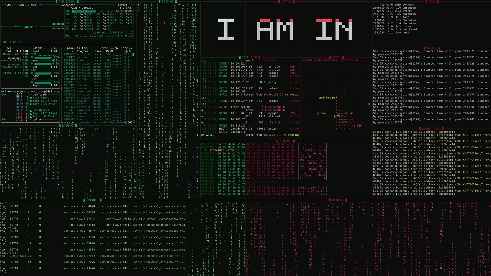

<div align="center">

# h4x0r

**A 90s hacker-movie workspace, one click from your Omarchy bar.**

Matrix rain, a sweeping radar, a fake intrusion log, a scrolling memory dump,
live syslog and sockets, `btop`, and a music visualiser — arranged
asymmetrically so it reads as a break-in rather than a spreadsheet.

</div>



<sub>The grid layout in <code>--palette phosphor</code>. Out of the box h4x0r
takes its colours from whatever Omarchy theme you are running — see below — and
six fixed CRT palettes are a click away in the popout.</sub>

---

## What it does

A bar widget and a popout that build a twelve-pane terminal workspace in
**herdr** or **tmux**, then tear it down again. The popout is a thin face over
a single script (`bin/h4x0r`); everything it shows comes from
`h4x0r --status --json`, and everything it does is a detached `h4x0r` call, so
the command line and the bar always agree.

The panes fill in one at a time, each typing a short bring-up line before its
program starts.

### The panes

| Pane | What it is |
|------|------------|
| RAIN 01 / 02 / 03 | Matrix rain, one narrow full-height stripe and two fillers |
| THE GIBSON | `btop` |
| SECTOR SWEEP | Radar sweep with fading contacts and callsigns |
| INTRUSION | Fake intrusion log — **theatre only**, nothing touches the network |
| MEMDUMP | Hex dump of `os.urandom()` dressed as a decrypt |
| STATUS | Blocky pulsing banner and clock |
| UPLINKS | Real `ss` socket table |
| SYSLOG / KERNEL RING | Real `journalctl -f` and `journalctl -kf` |
| PROC | Real process table |
| AUDIO | `cliamp` with a visualiser, when it is installed and free |

The intrusion log and the memory dump are deliberate fiction: random hosts from
a hard-coded list of movie mainframes and random bytes. They perform no scans,
no connections, and no reads of anything sensitive. Everything else on that
list is your machine's real telemetry.

## Install

```bash
omarchy plugin add https://github.com/johnsideserf/omarchy-h4x0r
```

Then set up the command line side and put the widget on the bar:

```bash
~/.config/omarchy/plugins/io.github.johnsideserf.h4x0r/install.sh
omarchy bar put io.github.johnsideserf.h4x0r --section right
```

`install.sh` links `bin/h4x0r` into `~/.local/bin`, writes the pane programs to
`~/.local/share/hacker-panes`, and adds two Omarchy menu rows. Pass `--no-menu`
to skip the menu rows, or `--keybind` to also bind `SUPER + SHIFT + H`.

## Remove

```bash
omarchy plugin remove io.github.johnsideserf.h4x0r
rm -f ~/.local/bin/h4x0r
rm -rf ~/.local/share/hacker-panes
```

`omarchy plugin remove` takes the widget off the bar as part of removing it.

If you used `--no-menu`, nothing else was touched. Otherwise delete the two
`trigger.h4x0r` rows from `~/.config/omarchy/extensions/omarchy-menu.jsonc`,
and the `SUPER + SHIFT + H` binding from `~/.config/hypr/bindings.lua` if you
asked for it.

## Dependencies

**Required**

- `python3` (3.8+) — the pane programs
- `bash`
- **herdr** or **tmux** — somewhere to put the panes

**Optional**

- `btop` — the system monitor pane, skipped if missing
- `cliamp` — the music visualiser; the slot falls back to a third rain when
  cliamp is absent or already playing elsewhere
- `journalctl`, `ss`, `watch`, `ps` — the real-telemetry panes

Nothing is installed on your behalf.

## Using it

Click the skull. Or:

```bash
h4x0r                     # build it and jump to it
h4x0r --layout cinema     # auto (default), grid (12), cinema (5), minimal (3)
h4x0r --palette amber     # theme, phosphor, amber, ice, crimson, synthwave, mono
h4x0r --mux tmux          # herdr, tmux, or auto
h4x0r --instant           # skip the staged reveal
h4x0r --status --json     # what is running, and where
h4x0r --close             # tear it down
```

In the popout: arrows to move, Enter to activate, and `e` engage, `d`
disengage, `r` rebuild, `m` music, `p` palette. Right-click the bar icon to
engage without opening the popout; middle-click to disengage.

## Settings

| Key | Default | What it does |
|-----|---------|--------------|
| `multiplexer` | `auto` | `auto` prefers herdr when its server is reachable, then tmux |
| `layout` | `auto` | `auto` fits the layout to the window; or `grid` (12 panes), `cinema` (5), `minimal` (3) |
| `palette` | `theme` | `theme` follows your Omarchy colors; or `phosphor`, `amber`, `ice`, `crimson`, `synthwave`, `mono` |
| `music` | `true` | Give the bottom strip a cliamp visualiser |
| `pollSeconds` | `6` | How often the popout polls `h4x0r --status` while open |

The palette applies to the pane programs too, not just the popout — `theme`
reads your current Omarchy `colors.toml` and recolors the rain, radar, banner,
memory dump, intrusion log, and socket table to match.

## Editing the panes

The pane programs are embedded in `bin/h4x0r` and written to
`~/.local/share/hacker-panes` on first run. They are **never overwritten**
after that, so edit them freely. `h4x0r --refresh` restores the originals and
`h4x0r --extract` writes them out without building anything.

Each one is a standalone script — run `python3 ~/.local/share/hacker-panes/radar.py`
in any terminal.

## Window size

`auto` measures the window and picks: **grid** at 220 columns or wider,
**cinema** from 130, **minimal** below that. `btop` draws an error box under
about 80 columns, so a monitor pane narrower than that gets `top` instead.
Force any layout with `--layout` and it is honoured regardless.

## Screenshots

`scripts/shot.py` renders a preview without opening a window: it builds the
layout in a detached tmux session at an exact character size, reads the panes
back as ANSI text, and draws the image itself.

```bash
scripts/shot.py --layout grid --palette phosphor --out preview.webp
scripts/shot.py --layout cinema --palette theme --out /tmp/cinema.png
```

`--palette theme` reads the active Omarchy theme, the same as the plugin does,
so a screenshot shows what the machine it ran on actually looks like.

It generates a matching btop theme on the fly so the monitor pane is in the
same palette as everything else. No window is opened, so no other application
can end up in the frame.

In the panes that carry real telemetry it masks addresses, your username, pids
and the socket table's process column by default; `--no-redact` turns that off.
The process tables in the monitor and PROC panes are left alone — program
names and pids are what those panes are, and pids are ephemeral and local. The generated panes are never masked, so the intrusion log's
invented addresses still read as addresses.

| | |
|---|---|
|  |  |
| `--palette theme`, on the Netrunner theme — the default, so this is red here and your colours on your desktop | `--palette amber`, the P3 CRT palette |
|  |  |
| `--layout cinema`, five larger panes | the same grid either way: phosphor left, theme right |

## Notes

- Layout ratios say what the *original* pane keeps. tmux's `-l` sizes the *new*
  pane, so the tmux backend converts with `100 - r×100`.
- tmux pane titles are re-applied after the programs start, because the shell
  prompt's title escape overwrites anything set before the command runs.
- Editing `Panel.qml` needs `omarchy restart shell`. Saving logs a reload and
  `rescanPlugins` reports success, but the bar keeps the previously compiled
  widget.

## License

[MIT](LICENSE)
